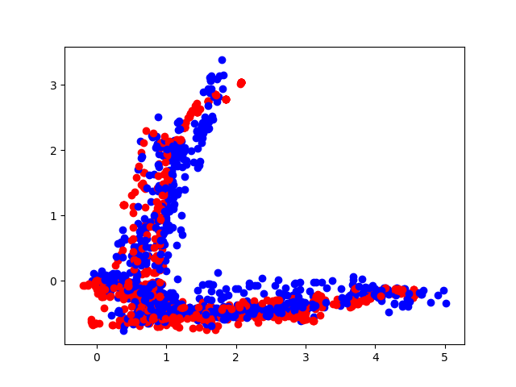
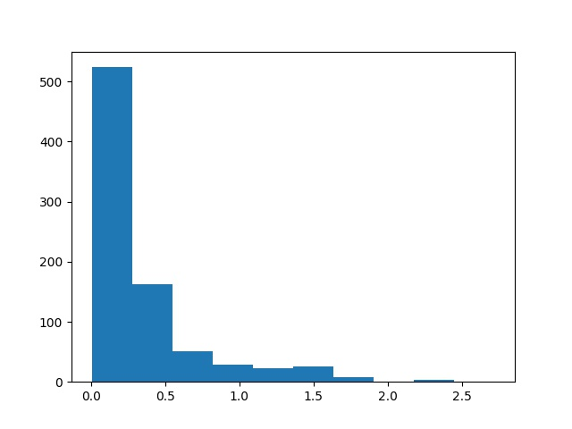
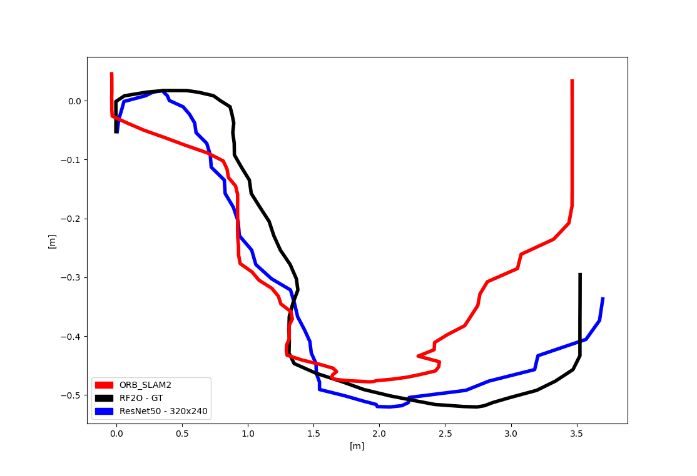

# odometry-net
A neural network trained for robot odometry predictions based on navigation environment images.

This repository refers to a work presented in SBESC-2021 (XI Brazilian Symposium on Computing Systems Engineering) entitled ["Deep-Learning-Based Visual Odometry Models for Mobile Robotics"](https://sol.sbc.org.br/index.php/sbesc_estendido/article/view/18504). It also has a [extended version in Portuguese](https://www.monografias.ufop.br/handle/35400000/3738). 

This repository has codes for running inference, test, and training a neural network for odometry. The basic idea is to make a deep-learning-based regression task to relate images to known x,y positions within a robot's navigation environment. With the trained neural network, it would be possible to navigate the previous environment with odometry data, using only a monocular camera. This is interesting to eliminate the need for multiple robot sensors to calculate odometry.

Our main robot is based on ROS to handle sensor communications and SLAM. So to capture the ground truth positional data, we used the ROS native Odometry message. The dataset building process is done by the `capture_data.py` script.

We evaluated three neural network architectures for this task: ResNet50, VGG16, and a custom CNN. The training scripts are respectively: `resnet_train.py`, `train_vgg.py` and `train_cnn_no_backbone.py`. The annotation files are served as examples in the `annotations` folder.

The ResNet model converged better to our dataset. So we evaluated the trained models with a scatter plot and a histogram. The error histogram is based on the mean error as the Euclidean distance metric. The following figures show these plots that are generated by the script `model_test.py`.

At last, we compared the monocular odometry predictions (ResNet backbone) to the ORB_SLAM algorithm. We compared the positional data outputted by ORB_SLAM to our neural network predictions. The results are described in the next figure. This figure is generated by the script in `plot_trajectory.py`.

